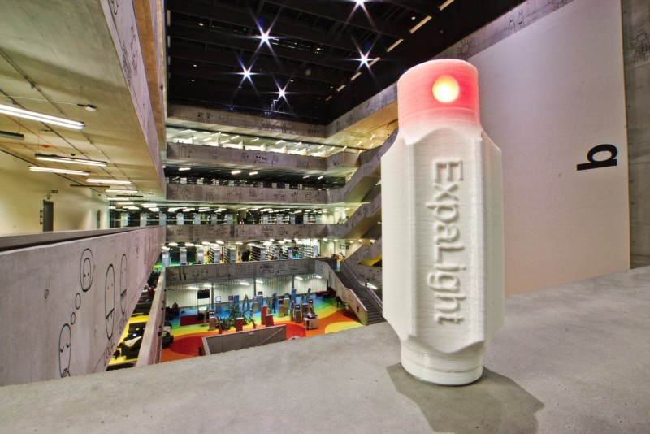

# ExpaLight

Super-capacitor based LED red light for astronomical observations. The main intended use is for the observing nights at summer astronomical school at Upice observatory.

## What are the benefits of using this flashlight?

Astronomers need a red light flashlight because it does not destroy dark adaptation of the human eye.

* Repairable open-source design with 3D printed chassis
* Do not need batteries 
* Could be charged by standard smart-phone charger or by a computer USB port in few seconds
* It is robustness and almost waterproof

## Do this flashlight needs to be turned off?

No, it could shine all night until full discharge. It allows very robust design without mechanic switches. You only need a smart-phone charger or microUSB cable and USB port to light-up the flashlight again. 

## Why is the overall design of flashlight such complicated?

It is the result of many use cases. The flashlight could be used in hand, stand vertically on the table, placed horizontally on paper and it does not roll. It could also be used as a headlamp etc.

## Where can I buy it?
You can on [Tindie](https://www.tindie.com/products/UST_Store/expalight/) or in our [e-shop](http://www.ust.cz/shop/product_info.php?products_id=271). 
