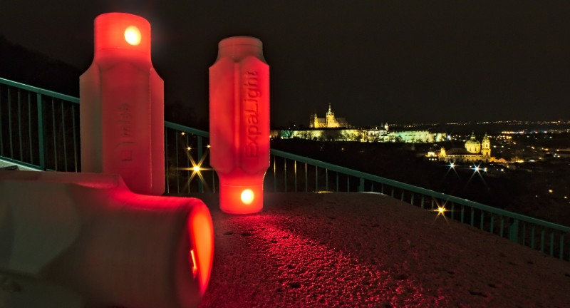
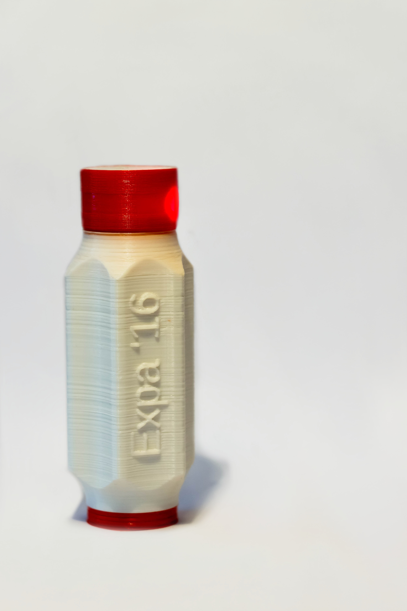

 [Facebook](https://www.facebook.com/expalight)

# ExpaLight

**ExpaLight** is a red LED flashlight powered by a supercapacitor, designed especially for astronomical observations. The project originated for use during observation nights at summer astronomical schools at the observatory. Thanks to its robust and open-source design, ExpaLight is suitable for both amateur and professional users.

## Technical Parameters

| Parameter           | Value                                |
| ------------------- | ------------------------------------ |
| Stored energy       | 350 J                                |
| Light duration      | \~10 h                               |
| Charging time       | < 50 s (typ.), max. 2 min            |
| Charging indication | Green LED off at 80% voltage         |
| Charging interface  | MicroUSB, ≤500 mA                    |
| Housing             | 3D-printed PLA, durable, water-resistant |
| Light Source        | High-efficiency red LED              |

## Key Features

* **Supercapacitor energy storage** (350 J)
* **Light duration:** up to 10 hours
* **Fast charging:** typically under 50 seconds, max. 2 minutes from full discharge
* **Charging indication:** green LED turns off at \~80% voltage
* **Durable 3D-printed housing**, mechanically and water resistant
* **High-efficiency red LED**, optimized for dark adaptation of the human eye
* **No batteries needed**, USB charging (microUSB)
* **Open-source and repairable**

ExpaLight remains an active project despite repository inactivity. The design was made to withstand years of usage.

[Product manual – Czech version](/DOC/ExpaLight_navod.pdf)

## Why red light?

Astronomers use red light because it preserves the dark adaptation of the human eye, making it ideal for observing the night sky.

## Usage

* Can be placed **horizontally** (ideal for writing into observation logs)
* Can stand **vertically** with LED up or down
* Can be recharged while in use
* Works even when permanently connected to a charger

## Maintenance

* Clean with cloth and mild soapy water
* Do not wash under running water or immerse in liquids
* Avoid abrasive tools to prevent scratching the housing

## Frequently Asked Questions

**Do I need to switch it off?**
No. The flashlight has no mechanical switch. It shines until fully discharged, then you recharge it via USB.

**Why this shape?**
The hexagonal body prevents rolling, ensures stable positioning on surfaces, and supports versatile use (e.g. headlamp attachment in future).

**Can I leave it charging permanently?**
Yes. The electronics are designed to handle permanent connection safely.

**What happens if it is fully discharged?**
Nothing. Unlike battery-based lamps, the supercapacitor can be fully discharged without degradation.

**Can I use a mobile charger?**
Yes. Any standard microUSB charger (5V, ≤500 mA) or USB port will work. Some smart chargers may fail due to low current draw — in that case, use another charger.

## Availability

You can purchase ExpaLight at [Tindie](https://www.tindie.com/products/10265/) or contact us directly at **[sale@ust.cz](mailto:sale@ust.cz)**.

## Contributions

ExpaLight is an open-source hardware project. Suggestions and improvements are welcome! Please open an issue in the [GitHub tracker](https://github.com/UniversalScientificTechnologies/ExpaLight/issues).

